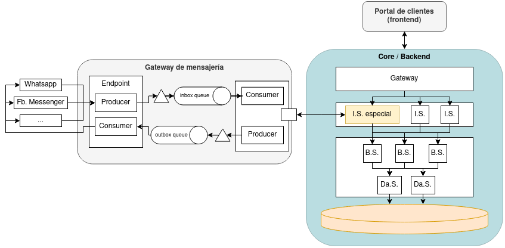
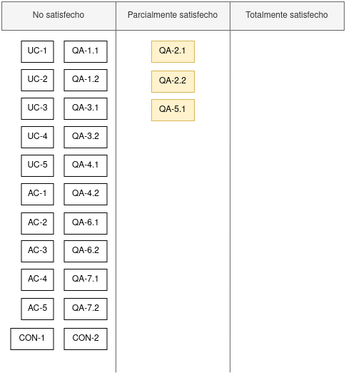

  <a href="https://github.com/ramaaorella/final_disenio#proceso-add-e-iteraciones"> Volver al índice</a> 
  &nbsp;&nbsp;|&nbsp;&nbsp;
  <a href="https://github.com/ramaaorella/final_disenio/blob/main/add-process/design-iterations/iteration-1.md"><i>>> <ins>Siguiente documento:</ins> Iteración 1</i></a>

## Iteración 0

  Si bien no es estrictamente parte de la metodología ADD realizar esta "iteración cero", se incluye como parte de las iteraciones del proceso (más precisamente como un paso previo a las mismas), en favor de dejar documentado un análisis de la arquitectura inicial y cómo esa arquitectura ya satisface (de forma parcial, total, o nula) los architectural drivers.

  Cabe aclarar que igualmente el método ADD indica que en caso de querer realizar un diseño para sistemas existentes, antes de realizar las iteraciones de diseño (que comenzarían con una primera iteración desde el paso 3), resulta necesario asegurarse que se tiene una comprensión clara de la arquitectura existente del sistema; lo cual concuerda con el objetivo del presente documento.

### Arquitectura existente

  

<dl><dd align="justify">
  

    A partir de lo expresado en la <a href="https://github.com/ramaaorella/final_disenio/blob/main/add-process/design-inputs/0.unrefined-design-inputs.md#5-arquitectura-nocional-inicial">documentación</a> de la arquitectura nocional inicial, se desprenden las siguientes responsabilidades para cada elemento presente:
  

- **_Gateway de mensajería:_** Recepción y envío de mensajes.
- **_Core:_** Persistencia y procesamiento de mensajes. Tratamiento de las solicitudes realizadas desde el portal de clientes.

  - <ins>Gateway:</ins> básicamente este componente sigue el patrón _API Gateway:_ registra los distintos servicios disponibles y ofrece al frontend un único punto de entrada para consumir las APIs de los distintos servicios; y ofrece características de seguridad.

  El resto sigue una jerarquía de servicios de integración, servicios de negocio y servicios de acceso a datos, lo cual es un enfoque común y efectivo de organizar una arquitectura SOA:

  - <ins>Capa de integración:</ins> compuesta por _integration services_ que proveen un API que delega en funcionalidad “básica” provistos por los servicios del tier anterior. Los servicios de integración no acceden directamente a los almacenamientos de datos. 
    Existe un servicio de integración especial que articula con el Gateway de Mensajeria responsable de los canales.
  - <ins>Servicios y acceso a datos:</ins> compuesta por _business services_ (los distintos servicios de la plataforma) y _data-access services_ (servicios que encapsulan las funciones “atómicas” relacionadas con grupos de entidades de datos. Estos servicios solamente acceden a sus propias bases de datos, ya sea para operaciones de consulta o de escritura).

- **_Portal de clientes:_** Interfaz web para los operadores del sistema.
</dd></dl>

(<a href="#top">Volver al inicio</a>)

### Ventajas y desventajas del diseño existente

<dl><dd>
  <table>
    <tr>
      <th>Diseño arquitectura</th>
      <th>Ventajas</th>
      <th>Desventajas</th>
    </tr>
    <tr>
      <td>Cliente-servidor</td>
      <td><ul>
        <li><ins>Centralización del control:</ins> los accesos, recursos y la integridad de los datos son controlados por el servidor.</li>
        <li><ins>Escalabilidad:</ins> se puede aumentar la capacidad de clientes y servidores por separado; y en caso de agregar servidores, poder manejar una mayor carga de trabajo.</li>
        <li><ins>Fácil mantenimiento/fiabilidad:</ins> es posible reemplazar, reparar, actualizar, o incluso trasladar un servidor, mientras que sus clientes no se verán afectados por ese cambio (o se afectarán mínimamente).</li>
      </ul></td>
      <td><ul>
        <li><ins>Dependencia del servidor:</ins> si el servidor falla, todos los clientes se verán afectados.</li>
        <li><ins>Congestión del tráfico:</ins> problemas en servidor ante una gran cantidad de clientes enviando peticiones simultáneas al mismo pueden causar una sobrecarga y disminuir el rendimiento.</li>
        <li><ins>Latencia:</ins> la latencia puede ser un problema si la conexión de red es lenta o inestable.</li>
        <li><ins>Carece de robustez:</ins> cuando un servidor está caído, las peticiones de los clientes no pueden ser satisfechas.</li>
        <li><ins>Los clientes no pueden compartir información:</ins> la única forma es obtenerla a través de la que proporciona el servidor.</li>
      </ul></td>
    </tr>
    <tr>
      <td>SOA</td>
      <td><ul>
        <li><ins>Fácil escalabilidad:</ins> facilidad y eficiencia al extender los procesos de negocio, permitiendo que los servicios se ejecuten en múltiples plataformas, lenguajes de programación y servidores dentro de un entorno.</li>
        <li><ins>Bajo nivel de acoplamiento:</ins> los servicios deben tener tan poca dependencia en recursos externos, como modelos de datos o sistemas de información, como sea posible. También deben prescindir de un estado sin retener ninguna información sobre sesiones o transacciones pasadas. De esta forma, si se modifica un servicio, no afectará de forma significativa a las aplicaciones del cliente ni a otros servicios que utilicen dicho servicio.</li>
        <li><ins>Interoperabilidad:</ins> cada servicio incluye documentos descriptivos que especifican la funcionalidad del servicio, así como las condiciones y términos relacionados. Cualquier sistema de cliente puede ejecutar un servicio, independientemente de la plataforma o el lenguaje de programación subyacente.</li>
        <li><ins>Reusabilidad:</ins> permite la reutilización de los servicios en múltiples aplicaciones de forma independiente sin interactuar con otros servicios.</li>
        <li><ins>Fiabilidad:</ins> si un servicio falla, solo afectará a las aplicaciones que dependen de él, lo que minimiza el impacto en el sistema en su conjunto.</li>
        <li><ins>Fácil mantenimiento:</ins> permite mantener y actualizar la aplicación mediante cambios en los servicios correspondientes (entendidos como entidades independientes).</li>
      </ul></td>
      <td><ul>
        <li><ins>Proclive a requerir servidores de alto ancho de banda y recursos:</ins> requiere una mayor cantidad de recursos para el envío y recepción de mensajes entre servicios, así como para el procesamiento y la integración de los mismos. Si algún servicio web envía y recibe mensajes e información con frecuencia, alcanza fácilmente un gran número de solicitudes por día.</li>
        <li><ins>Sobrecarga adicional:</ins> En SOA, todas las entradas se validan antes de enviarlas al servicio. Si está utilizando varios servicios se generará una sobrecarga por cómputo adicional, además de la ya producida por la complejidad de la integración de servicios, el impacto en el desempeño y la posible latencia añadida que impone la arquitectura.</li>
      </ul></td>
    </tr>
    <tr>
      <td>Jerarquía de servicios en SOA</td>
      <td><ul>
        <li><ins>Modularidad:</ins> cada nivel de servicios tiene una función específica, lo que hace que la aplicación sea más fácil de mantener y escalar.</li>
        <li><ins>Flexibilidad:</ins> los servicios pueden modificarse y escalarse independientemente, lo que facilita la evolución de la aplicación.</li>
        <li><ins>Integración:</ins> los servicios de integración facilitan la integración de aplicaciones externas y la integración con otros sistemas.</li>
        <li><ins>Reusabilidad:</ins> los servicios de negocio pueden reutilizarse en múltiples aplicaciones, lo que agiliza el desarrollo y reduce el tiempo y los costos.</li>
      </ul></td>
      <td><ul>
        <li><ins>Latencia:</ins> el uso de servicios puede agregar latencia a la aplicación, especialmente si hay una gran cantidad de servicios o si se requiere una comunicación frecuente entre los servicios.</li>
      </ul></td>
    </tr>
  </table>

  
Como se puede observar en la tabla, se tiene que las elecciones a nivel diseño tomadas al momento en cuanto a la arquitectura del sistema no se oponen a los objetivos del negocio ni a los objetivos que persigue el nuevo diseño; en particular, las ventajas de cada modelo arquitectónico resultan favorables para estos objetivos. Si se debe tener especial consideración en las desventajas de cada modelo para mitigarlas mediante una buena planificación y diseño del sistema.
 
  
  
Estos modelos arquitectónicos permiten satisfacer de forma parcial aquellos <i>architectural drivers</i> orientados a la escalabilidad, modularización y extensiblidad del sistema.

</dd></dl>

(<a href="#top">Volver al inicio</a>)

### Desglose de la arquitectura

<dl><dd align="justify">
  

    Si bien la documentación de la arquitectura ya asigna responsabilidades a cada componente, se considera que esas responsabilidades no logran exhibir por completo el próposito de cada componente y sus obligaciones para que el sistema pueda alcanzar los <i>architectural drivers</i> propuestos. 
  

  

    Por esta razón, se desglosa la arquitectura y se distinguen distintas responsabilidades suplementarias a los componentes:
  

  

- **_Gateway de mensajería:_** Se basa en principio en la implementación de dos canales dividiendo mensajes entrantes y salientes para la recepción, encolado y el envío de los mismos. Debe operar con los distintos canales que se integren al sistema, y considerar la integración de APIs futuras, garantizando la entrega de mensajes (tanto en la comunicación con el servicio de integración especial del Core, como en la comunicación con los sistemas con los que interopera), considerando que los servicios pueden estar no disponibles o que incluso el servidor de RabbitMQ puede detenerse o reiniciarse. Debe también llevar cuenta de la trazabilidad de los mensajes.
Dado que actúa como puerta de entrada al Core, es responsabilidad también de este componente mantener la carga de mensajes hasta que el Core pueda procesarlos por demanda. A su vez, al estar en contacto con los sistemas con los que se interopera, puede encargarse en principio también de la homogeneización de los mensajes para su tratamiento, y viceversa.
- **_Core (en forma abstracta):_** Deberá mantener la trazabilidad de los mensajes, el conjunto de usuarios en línea (para darles prioridad y no impactar sobre la fluidez en su experiencia de usuario) y demás datos necesarios para el portal. La comunicación entre servicios no debe generar una sobrecarga adicional de gran impacto; sobre todo la comunicación con el Gateway de mensajería debe ser lo más fluida posible. Debe tratar de optimizar la capacidad de procesamiento y minimizar el tiempo para procesar los mensajes en favor de mantener un buen rendimiento. 
- **_Servicio de integración especial:_** Además de articular con el Gateway de mensajería para recibir y enviar mensajes, deberá comunicarse otros servicios para persistir todos los mensajes (asegurándose de no impactar en gran medida en el rendimiento del sistema) y procesarlos.

<ins>Concerns de la arquitectura inicial:</ins>

- La capacidad de procesamiento de los mensajes en el Core puede propiciar un cuello de botella para el funcionamiento del sistema, al igual que la persistencia de los mensajes y demás datos, que requieren ser lo suficientemente adecuados para manejar la posible gran cantidad de usuarios y mensajes entrantes y salientes, además de la velocidad de procesamiento requerida para lograr la fluidez necesaria para el objetivo de negocio. Debe considerarse también los impactos de la comunicación entre servicios y componentes, y que toda comunicación puede pasar a ser potencialmente una comunicación con componentes/servicios desplegados en entornos distintos.
- La base de datos relacional puede ser contraproducente para la escalabilidad del sistema, al no ser adecuada para manejar la cantidad de datos y la velocidad a la que se deben procesar.
- La pérdida de mensajes en el Gateway de mensajería puede ser irrecuperable, ante fallos o picos de demanda.

  Cabe aclarar que el esquema realizado de la arquitectura desglosada no sigue ningún formato específico, sino que, al igual que el esquema original, se trata de un bosquejo nocional del sistema. 

</dd></dl>

(<a href="#top">Volver al inicio</a>)

### Design kanban board

<dl><dd>

  Tal como se mencionó al analizar los modelos arquitectónicos utilizados, la arquitectural inicial del sistema permite satisfacer de forma parcial los <i>architectural drivers</i> orientados a la escalabilidad, modularización y extensiblidad del sistema; en particular se satisfacen parcialmente los escenarios de calidad <a href="https://github.com/ramaaorella/final_disenio/blob/main/add-process/design-inputs/qa-scenarios/qa2.1-scenario.md">QA-2.1</a>, <a href="https://github.com/ramaaorella/final_disenio/blob/main/add-process/design-inputs/qa-scenarios/qa2.2-scenario.md">QA-2.2</a> y <a href="https://github.com/ramaaorella/final_disenio/blob/main/add-process/design-inputs/qa-scenarios/qa5.1-scenario.md">QA-5.1</a>.

  

</dd></dl>

(<a href="#top">Volver al inicio</a>)

