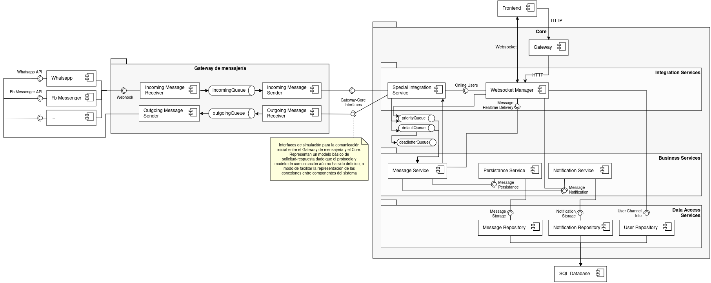
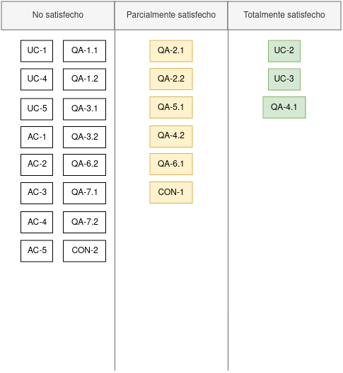

  <a href="https://github.com/ramaaorella/final_disenio#proceso-add-e-iteraciones"> Volver al índice</a> 
  &nbsp;&nbsp;|&nbsp;&nbsp;
  <a href="https://github.com/ramaaorella/final_disenio/blob/main/add-process/design-iterations/iteration-2.md"><i>>> <ins>Siguiente documento:</ins> Iteración 2</i></a>

## Iteración 1

### Iteration goal

En esta primera iteración, se decide comenzar a refinar el sistema a partir de los dos principales casos de uso: el flujo de mensajes entrantes (<a href="https://github.com/ramaaorella/final_disenio/blob/main/add-process/design-inputs/1.review-design-inputs.md#primary-functional-requirements">UC-2</a>) y el flujo de mensajes salientes (<a href="https://github.com/ramaaorella/final_disenio/blob/main/add-process/design-inputs/1.review-design-inputs.md#primary-functional-requirements">UC-3</a>). Este enfoque permite refinar e instanciar los componentes necesarios para respaldar esta funcionalidad, para luego abordar los escenarios de calidad implicados. Para ello, se tomará como base la arquitectura inicial nocional, considerando además las implicaciones de las tecnologías utilizadas en el prototipo (que se consideran una restricción organizacional -<a href="https://github.com/ramaaorella/final_disenio/blob/main/add-process/design-inputs/1.review-design-inputs.md#constraints">CON-1</a>-, al entender que el equipo de desarrollo se encuentra familiarizado con las mismas), de forma de poder alinearse con los recursos disponibles y las habilidades del equipo de desarrollo.

Para evitar que la iteración se limite sólo a la instanciación de componentes y asignación de responsabilidades, se aprovechan estos casos de uso como oportunidad para evaluar la satisfacción de uno de los escenarios de calidad relacionados (<a href="https://github.com/ramaaorella/final_disenio/blob/main/add-process/design-inputs/qa-scenarios/qa4.1-scenario.md">QA-4.1</a>), que ha sido identificado como prioritario. De esta manera, no sólo se aborda el diseño en cuanto a la implementación de la funcionalidad, sino también se busca garantizar desde el principio la calidad en ese flujo de mensajes para cumplir con las expectativas del sistema.

(<a href="#top">Volver al inicio</a>)

### Elements of the System to Refine

En esta primera iteración, se refinarán dos componentes críticos del sistema: el Gateway de mensajería y las capas de servicios del Core, que incluye los servicios de integración, servicios de negocio y servicios de acceso a datos. La elección de centrarse en estos elementos se basa en su papel fundamental para gestionar eficazmente el flujo de mensajes entrantes y salientes, lo que, a su vez, permite satisfacer los drivers y objetivos de esta iteración.

(<a href="#top">Volver al inicio</a>)

### Design concepts and considerations

<table>
   <thead>
    <tr>
      <th>Related drivers</th>
      <th>Design considerations</th>
      <th>Rationale and Assumptions</th>
    </tr>
  </thead>
  <tbody>
    <tr>
      <td rowspan="4">UC-2, UC-3, QA-4.1</td>
      <td>Comunicación sincrónica o asincrónica entre componentes (Gateway de mensajería-Core y Core-Frontend)</td>
      <td>Considerando la naturaleza del flujo de mensajes entre el Gateway de mensajería, el Core y el Frontend, es crucial decidir el tipo de comunicación que mejor se adapte a las necesidades del sistema. La comunicación sincrónica garantiza una respuesta inmediata antes de que el remitente pueda continuar con su ejecución, lo que puede ser beneficioso para sincronización y confirmaciones de mensajes, pero puede aumentar la complejidad y el riesgo de bloqueo. En contraste, la comunicación asincrónica permite un procesamiento más fluido y mejora la escalabilidad y la tolerancia a fallos, aunque puede introducir latencia y requerir sincronización adicional.</td>
    </tr>
    <tr>
      <td>Comunicación sincrónica o asincrónica entre servicios</td>
      <td>Al igual que entre componentes, la comunicación entre servicios puede tratarse de una comunicación sincrónica o asincrónica. A diferencia del caso anterior, debe considerarse la dependencia potencial entre servicios al decidir el tipo de comunicación, ya que se puede requerir sincronicidad para garantizar la integridad y coherencia del sistema. Es importante tener en cuenta que cada enfoque tiene sus propias ventajas y desventajas, y por ello, es necesario evaluar el tipo de comunicación en función de las necesidades específicas de cada interacción entre servicios.</td>
    </tr>
    <tr>
      <td>Orquestación descentralizada entre servicios</td>
      <td>La orquestación descentralizada permite que los servicios coordinen sus interacciones de forma independiente, sin depender de un sistema central para gestionar su ejecución. Este enfoque no sigue el patrón tradicional de arquitectura orientada a servicios (SOA), en el que se suele centralizar la gestión de los servicios a través de un bus de servicios o un orquestador centralizado. En cambio, con la orquestación descentralizada, los servicios son más autónomos y pueden operar de manera independiente, lo que mejora la escalabilidad y resiliencia del sistema. Sin embargo, esta estrategia introduce desafíos, como la gestión de la consistencia de los datos y la coordinación entre servicios distribuidos. Es fundamental evaluar si la complejidad adicional de la orquestación descentralizada es compatible con los objetivos del sistema y si se dispone de mecanismos adecuados para manejar la consistencia eventual y las posibles fallas de comunicación.</td>
    </tr>
    <tr>
      <td>Gestión de la persistencia de mensajes como parte del procesamiento</td>
      <td>La integración de la persistencia como parte del procesamiento de mensajes presenta ventajas en términos de eficiencia y consistencia de datos al garantizar la integridad de los mismos. Sin embargo, esta integración puede aumentar la latencia del procesamiento. Por otro lado, desacoplar la persistencia del procesamiento intrínseco del mensaje simplifica el diseño y mejora la velocidad de procesamiento, aunque puede introducir posibles problemas de consistencia y riesgos de pérdida de datos en caso de fallos del sistema.</td>
    </tr>
    <tr>
      <td>UC-2</td>
      <td>Visualización de mensajes entrantes en tiempo real o diferido</td>
      <td>Dado que la forma de visualización de mensajes entrantes no está especificada como parte de los requisitos, surge la disyuntiva de cómo mostrar esos mensajes entrantes. Las notificaciones en tiempo real se plantean como una opción para alinearse con la funcionalidad comúnmente esperada en sistemas de mensajería, lo cual permite una experiencia inmediata y una respuesta rápida. Sin embargo, esta elección puede incrementar la carga del sistema y la latencia de procesamiento, ya que el sistema debe encargarse de mostrar las notificaciones tan pronto como llegan. Por otro lado, utilizar un enfoque de visualización diferido reduce la carga del sistema y la latencia, ya que permite que el sistema desacople esta funcionalidad y realice las notificaciones de manera no inmediata, aunque genere una experiencia de usuario menos fluida.</td>
    </tr>
    <tr>
      <td rowspan="3">QA-4.1</td>
      <td>Priorizar mensajes de usuarios en línea</td>
      <td>La priorización de mensajes de usuarios en línea se considera como una estrategia para mejorar la latencia del sistema al garantizar que los mensajes críticos se procesen y entreguen de manera más rápida, lo que puede resultar en una experiencia de usuario más fluida. Sin embargo, es importante tener en cuenta que esta priorización puede aumentar la carga de trabajo y la necesidad de recursos para su gestión. Además, existe el riesgo de que otros usuarios no prioritarios experimenten una degradación en su experiencia, ya que sus mensajes podrían no recibir una respuesta tan rápida como la de los mensajes prioritarios.</td>
    </tr>
    <tr>
      <td>Optimización latencia red</td>
      <td>La optimización de la latencia de red puede mejorar la velocidad de entrega de mensajes y la capacidad de respuesta del sistema, lo que puede conducir a una mejor experiencia del usuario. Sin embargo, al implementar estrategias para reducir los tiempos de transmisión y recepción de mensajes, como el uso de protocolos de comunicación livianos, la minimización de la sobrecarga mediante la eliminación de información innecesaria en los mensajes y el aprovechamiento de técnicas de almacenamiento en caché, es crucial mantener un equilibrio con otros aspectos fundamentales del sistema, como la integridad y la completitud de la información transmitida, así como el uso eficiente de los recursos disponibles.</td>
    </tr>
    <tr>
      <td>Reducción de la sobrecarga mediante co-locate</td>
      <td>La co-locación de recursos es una estrategia que puede reducir significativamente la latencia y mejorar la eficiencia del sistema en sistemas distribuidos al minimizar la sobrecarga de red y los tiempos de comunicación entre componentes. Si bien esta práctica está más asociada a entornos on-premise, también se aplica ampliamente en despliegues en la nube, aprovechando la selección de zonas o regiones específicas para alojar los servicios de manera más cercana. Al alojar componentes relacionados en proximidad física o virtual, se reduce la latencia inherente a las comunicaciones entre nodos, lo que puede resultar en una mejora notable en la capacidad de respuesta del sistema y en la experiencia del usuario. Sin embargo, esta estrategia puede aumentar la complejidad de la gestión de recursos y la dependencia entre componentes, lo que podría introducir riesgos adicionales en la operación del sistema y restricciones que dificultarían la escalabilidad horizontal a largo plazo.</td>
    </tr>
  </tbody>
</table>

(<a href="#top">Volver al inicio</a>)

### Design outputs

<ul>
  <li><a href="https://github.com/ramaaorella/final_disenio/blob/main/add-process/design-outputs/adrs/adr-001.md">ADR 001: Comunicación asincrónica entre componentes y servicios</a></li>
  <li><a href="https://github.com/ramaaorella/final_disenio/blob/main/add-process/design-outputs/adrs/adr-002.md">ADR 002: Estrategia de microservicios descentralizados para los flujos de mensajes en una arquitectura SOA</a></li>
  <li><a href="https://github.com/ramaaorella/final_disenio/blob/main/add-process/design-outputs/adrs/adr-003.md">ADR 003: Desacoplamiento de la persistencia del procesamiento de mensajes</a></li>
  <li><a href="https://github.com/ramaaorella/final_disenio/blob/main/add-process/design-outputs/adrs/adr-004.md">ADR 004: Priorización de mensajes de usuarios en línea en el procesamiento</a></li>
  <li><a href="https://github.com/ramaaorella/final_disenio/blob/main/add-process/design-outputs/adrs/adr-005.md">ADR 005: Implementación de notificaciones en tiempo real y diferidas (push)</a></li>
  <li><a href="https://github.com/ramaaorella/final_disenio/blob/main/add-process/design-outputs/adrs/adr-006.md">ADR 006: Optimización de la latencia de red y reducción de sobrecarga mediante protocolos livianos, reducción de mensajes y co-locación de recursos</a></li>
</ul>

<h4>- <a href="https://github.com/ramaaorella/final_disenio/blob/main/images/architecture/iteration-1.png">Diagrama C&C</a></h4>
<dl><dd>
  
  
  <table>
      <tr>
        <th>Element</th>
        <th>Responsibility</th>
      </tr>
      <tr>
        <td>Incoming Message Receiver</td>
        <td>Recepción de mensajes entrantes desde los diferentes canales de comunicación. Envío de mensajes procesados para la cola de mensajes entrantes.</td>
      </tr>
      <tr>
        <td>Incoming Message Sender</td>
        <td>Implementa el enlace de comunicación con el Core. Consume mensajes de la cola de mensajes entrantes y los envía a través de este canal.</td>
      </tr>
      <tr>
        <td>Outgoing Message Receiver</td>
        <td>Recepción de mensajes salientes desde el Core y envío a la cola de mensajes salientes para su entrega a los destinatarios finales a través de los servicios externos.</td>
      </tr>
      <tr>
        <td>Outgoing Message Sender</td>
        <td>Implementa el enlace de comunicación con sistemas externos para enviar los mensajes generados por el sistema. Se encarga de transmitir los mensajes a través del canal de comunicación apropiado para cada mensaje.</td>
      </tr>
      <tr>
        <td>Gateway</td>
        <td>Administra la autenticación, autorización y enrutamiento de solicitudes, proporcionando un punto único de entrada al sistema.</td>
      </tr>
      <tr>
        <td>Special Integration Service</td>
        <td>Actúa como el enlace en la comunicación con el Gateway de Mensajería. Se encarga de recibir los mensajes entrantes del Gateway de Mensajería y los mensajes salientes del Core, y enrutarlos debidamente para su procesamiento. Prioriza el procesamiento, transmitiendo con prioridad aquellos donde el usuario implicado se encuentra en línea. </td>
      </tr>
      <tr>
        <td>Websocket Manager</td>
        <td>Gestiona los canales de comunicación WebSocket del sistema. Se encarga de abrir, cerrar y mantener las conexiones WebSocket con los clientes. Además, recibe y envía mensajes a través de estos canales, facilitando la comunicación en tiempo real entre el servidor y los clientes. Implementa la lógica necesaria para gestionar múltiples conexiones WebSocket de manera eficiente y confiable.</td>
      </tr>
      <tr>
        <td>Message Service</td>
        <td>Se encarga de manejar la lógica de negocio relacionada con los mensajes en el sistema. Recibe mensajes entrantes y salientes, y los procesa según las reglas y lógica del negocio.</td>
      </tr>
      <tr>
        <td>Persistance Service</td>
        <td>Se encarga de gestionar la persistencia de datos en el sistema. Recibe los mensajes procesados del Message Service y se encarga de su almacenamiento permanente en la base de datos.</td>
      </tr>
      <tr>
        <td>Notification Service</td>
        <td>Se encarga de gestionar el envío de notificaciones a los usuarios del sistema mediante canales de notificación alternativos, cuando los mismos no se encuentran conectados.</td>
      </tr>
      <tr>
        <td>Message Repository</td>
        <td>Se encarga de gestionar el almacenamiento y recuperación de mensajes en el sistema. Proporciona métodos para crear, leer, actualizar y eliminar mensajes en la base de datos.</td>
      </tr>
      <tr>
        <td>Notification Repository</td>
        <td>Se encarga de gestionar el almacenamiento y recuperación de notificaciones en el sistema. Proporciona métodos para crear, leer, actualizar y eliminar notificaciones en la base de datos.</td>
      </tr>
      <tr>
        <td>User Repository</td>
        <td>Se encarga de gestionar el almacenamiento y recuperación de información de usuarios en el sistema. Proporciona métodos para crear, leer, actualizar y eliminar datos de usuario en la base de datos. </td>
      </tr>
    </table>
</dd></dl>

<h4>- <a href="https://github.com/ramaaorella/final_disenio/blob/main/add-process/design-outputs/diagrams/flujo-mensajes-entrantes-iteration-1.iuml">Flujo mensajes entrantes</a></h4>
<dl><dd>

</dd></dl>

<h4>- <a href="https://github.com/ramaaorella/final_disenio/blob/main/add-process/design-outputs/diagrams/flujo-mensajes-salientes-iteration-1.iuml">Flujo mensajes salientes</a></h4>
<dl><dd>

</dd></dl>

<h4>- <a href="https://github.com/ramaaorella/final_disenio/blob/main/add-process/design-outputs/diagrams/deployment-iteration-1.iuml">Diagrama deployment</a></h4>
<dl><dd>

</dd></dl>

#### Consideraciones

- Al optar por la comunicación asincrónica entre componentes y servicios, es fundamental asegurar que los mensajes lleguen en el orden correcto. La falta de orden puede afectar significativamente la coherencia de las conversaciones y la experiencia del usuario, especialmente a medida que el sistema escala horizontalmente. Este problema se convierte en un nuevo input a abordar en las próximas iteraciones de diseño, donde es necesario explorar estrategias para mitigar este problema y garantizar la coherencia del hilo de las conversaciones.

#### Sugerencias para implementación

- Para la implementación de notificaciones push, existen múltiples proveedores que podrían integrarse con la plataforma, como Firebase Cloud Messaging (FCM), OneSignal, Pusher, entre otros. La elección del proveedor dependerá de varios factores, incluyendo la cantidad de usuarios a manejar en el lanzamiento de la plataforma, los costos asociados que se puedan asumir y las habilidades del equipo de desarrollo. Dado que el proveedor seleccionado no tiene un impacto significativo en el diseño ni en la arquitectura general del sistema, se deja la decisión abierta para cuando se realice la implementación. Se recomienda buscar librerías que ofrezcan integración Maven para facilitar la incorporación con Spring Boot, y que a su vez, sean lo suficientemente escalables y fiables para mantener y no degradar la calidad del sistema.
- Para la implementación de canales WebSocket, se sugiere utilizar Spring WebSockets, que ofrece una integración sencilla con Spring Boot mediante las dependencias `spring-boot-starter-websocket` y `spring-messaging`.
- Para la implementación de RabbitMQ, se pueden aprovechar las dependencias proporcionadas por Spring Boot para integrarlo fácilmente (`spring-boot-starter-amqp`). Se recomienda hacer uso de las propias funcionalidades de RabbitMQ para implementar la estrategia de dead-lettering y TTL para evitar los problemas de starvation de mensajes.
- Para mantener localmente la lista de usuarios en línea en el SpecialIntegrationService y acelerar el enrutamiento de los mensajes considerando si deben priorizarse, se sugiere implementar una caché local utilizando la anotación `@Cacheable` de Spring Framework. Al habilitar el soporte de caché con la anotación `@EnableCaching` en una clase de configuración de Spring, se activará la funcionalidad de caché en la aplicación, utilizando la caché en memoria por defecto. Esto permitirá una recuperación más rápida de la información, reduciendo la latencia en el procesamiento de mensajes. Además, en caso de que el volumen de usuarios en línea crezca significativamente en el futuro, la caché puede ser fácilmente re-configurada para utilizar un proveedor externo.

(<a href="#top">Volver al inicio</a>)

### Analysis of current design and Review iteration

Durante esta iteración, se han tomado una serie de decisiones de diseño que tienen como objetivo abordar los drivers seleccionados para la iteración. A continuación, se detallan estas decisiones y cómo contribuyen a satisfacer dichos drivers, incluyendo aquellos inputs en los que la arquitectura actual puede llegar a contribuir sin ser drivers propios de esta iteración:

- Se satisface de forma parcial la restricción <a href="https://github.com/ramaaorella/final_disenio/blob/main/add-process/design-inputs/1.review-design-inputs.md#constraints">CON-1</a> en esta iteración, dado que se han considerado y respetado las tecnologías Java, MySQL, JHipster para Spring y RabbitMQ en el diseño inicial del sistema. Sin embargo, la evaluación completa de si estas tecnologías satisfacen todas las necesidades y requisitos del proyecto requerirá la finalización del diseño y la implementación completa del sistema. Por ello, no se puede afirmar que esta restricción organizacional pueda satisfacerse en su totalidad.
- Se satisfacen de forma total los casos de uso <a href="https://github.com/ramaaorella/final_disenio/blob/main/add-process/design-inputs/1.review-design-inputs.md#primary-functional-requirements">UC-2</a> y <a href="https://github.com/ramaaorella/final_disenio/blob/main/add-process/design-inputs/1.review-design-inputs.md#primary-functional-requirements">UC-3</a> en esta iteración, dado que se han instanciado los componentes necesarios y se han distribuido las responsabilidades para dar soporte a ambos flujos. En el caso de UC-2, el ingreso de mensajes de usuarios a través de un canal se gestiona, persiste y muestra al operador según lo requerido. Del mismo modo, en UC-3, el egreso de mensajes de operadores se transmite de manera efectiva al usuario correspondiente, cumpliendo con los objetivos establecidos para ambos casos de uso.
- Se satisface de forma total el escenario de calidad <a href="https://github.com/ramaaorella/final_disenio/blob/main/add-process/design-inputs/qa-scenarios/qa4.1-scenario.md">QA-4.1</a> en esta iteración. La arquitectura y las decisiones de diseño adoptadas están orientadas a garantizar un procesamiento eficiente y rápido de los mensajes, lo que permite una interacción fluida para los usuarios activos del sistema. Se valoraron y analizaron diversas estrategias asociadas para cumplir en general con este tipo de escenario de calidad, asegurando así que se implementen las soluciones más adecuadas para satisfacer las necesidades del sistema en términos de rendimiento y latencia.

  

(<a href="#top">Volver al inicio</a>)

