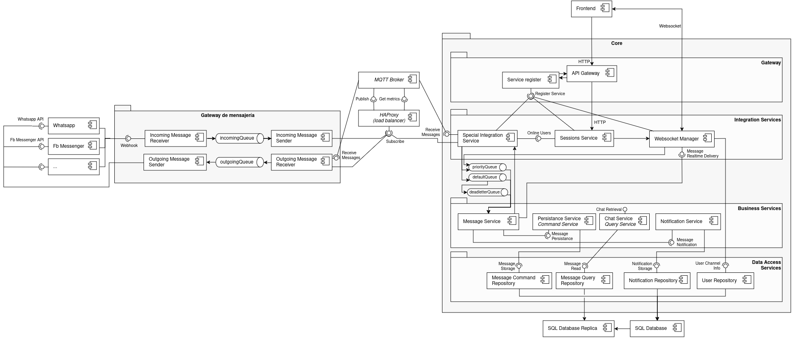
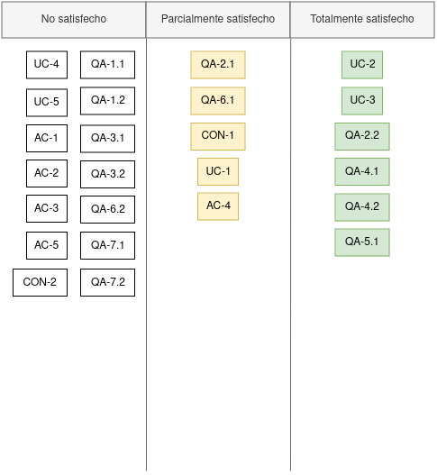

  <a href="https://github.com/ramaaorella/final_disenio#proceso-add-e-iteraciones"> Volver al índice</a> 
  &nbsp;&nbsp;|&nbsp;&nbsp;
  <a href="https://github.com/ramaaorella/final_disenio/blob/main/add-process/design-iterations/iteration-3.md"><i>>> <ins>Siguiente documento:</ins> Iteración 3</i></a>

## Iteración 2

### Iteration goal

En esta segunda iteración, se abordan los escenarios de calidad que continúan siendo de mayor prioridad: el primero, relacionado con el rendimiento del sistema en el procesamiento de mensajes, buscando garantizar una alta capacidad de procesamiento (throughput) (<a href="https://github.com/ramaaorella/final_disenio/blob/main/add-process/design-inputs/qa-scenarios/qa4.2-scenario.md">QA-4.2</a>), y el segundo, centrado en la escalabilidad horizontal del sistema (<a href="https://github.com/ramaaorella/final_disenio/blob/main/add-process/design-inputs/qa-scenarios/qa5.1-scenario.md">QA-5.1</a>).

Para alcanzar estos objetivos, se supone un escenario de alta carga de trabajo, donde el sistema debe enfrentar una demanda considerable, por encima de la normal. Esto permite evaluar las estrategias existentes y realizar los ajustes pertinentes en la configuración y diseño de los componentes, con el objetivo de mejorar el rendimiento y escalabilidad del sistema sin comprometer la calidad de los servicios. El objetivo principal es asegurar que el sistema pueda cumplir con los requisitos de rendimiento y escalabilidad establecidos, incluso bajo condiciones de alta carga, garantizando así una experiencia de usuario óptima y una operación eficiente del sistema.

(<a href="#top">Volver al inicio</a>)

### Elements of the System to Refine

En esta segunda iteración, se llevará a cabo una revisión de los componentes críticos del sistema, centrándose nuevamente en el Gateway de mensajería y las capas de servicios del Core. Aunque estos elementos ya fueron refinados en la iteración anterior para cumplir con los casos de uso específicos de los flujos de mensajes, su importancia central en la arquitectura y su influencia en el rendimiento y la escalabilidad del sistema demandan una revisión en esta segunda iteración. Es fundamental asegurar que estos componentes estén debidamente preparados para cumplir con los estándares de rendimiento y escalabilidad establecidos.

(<a href="#top">Volver al inicio</a>)

### Design concepts and considerations

<table>
   <thead>
    <tr>
      <th>Related drivers</th>
      <th>Design considerations</th>
      <th>Rationale and Assumptions</th>
    </tr>
  </thead>
  <tbody>
  <tr>
      <td>QA-4.2</td>
      <td>Selección del protocolo de comunicación entre el Gateway de mensajería y el Core</td>
      <td>La elección del protocolo de comunicación debe considerar la necesidad de manejar entornos de alta concurrencia y gran volumen de mensajes. Si bien debe tratarse de un protocolo liviano (<a href="https://github.com/ramaaorella/final_disenio/blob/main/add-process/design-outputs/adrs/adr-006.md">ADR-006</a>) que permita una transmisión eficiente y rápida de mensajes, debe buscarse un protocolo de mensajería cuyo modelo de comunicación permita optimizar el throughput del sistema y evitar posibles cuellos de botella en el procesamiento del Core, dado que podrían afectar negativamente el rendimiento de todo el sistema.</td>
    </tr>
    <tr>
      <td rowspan="2">QA-4.2, QA-5.1</td>
      <td>Definición de un diseño arquitectónico para el Gateway de Mensajería</td>
      <td>Dado que en la iteración anterior se configuraron los elementos necesarios para los flujos de mensajes en el Gateway de Mensajería, y considerando un escenario de alta carga de trabajo en esta iteración, se debe analizar si la solución propuesta es suficiente para satisfacer los requerimientos de escalabilidad y alto throughput. 
      El diseño monolítico, que podría considerarse el enfoque por defecto debido a que en la iteración anterior solo se instanciaron los elementos necesarios para asignar responsabilidades sin profundizar en detalles de arquitectura, podría simplificar la implementación inicial al reducir la complejidad y la coordinación entre componentes. Sin embargo, limita la escalabilidad y el manejo de grandes volúmenes de mensajes. En cambio, una arquitectura de microservicios (que continuaría con los lineamientos planteados para algunos servicios del Core -<a href="https://github.com/ramaaorella/final_disenio/blob/main/add-process/design-outputs/adrs/adr-002.md">ADR-002</a>-) distribuiría las responsabilidades en servicios independientes, optimizando tanto la escalabilidad como el rendimiento, aunque introduciendo mayor complejidad en el diseño, la coordinación entre servicios y la gestión de fallos distribuidos.</td>
</tr>
<tr>
<td>Introducir concurrencia mediante la paralelización de tareas</td>
<td>La paralelización de tareas se considera como una estrategia clave para mejorar el rendimiento del sistema al distribuir la carga de trabajo entre múltiples recursos. Esta estrategia puede aplicarse a dos niveles: dentro de los servicios, permitiendo ejecutar múltiples tareas simultáneamente y contribuyendo así a aumentar el throughput del Core y reducir los tiempos de respuesta; y a nivel de replicación de servicios, aprovechando la capacidad que el sistema debe tener de escalar horizontalmente, lo que permite distribuir la carga entre múltiples instancias de servicios u otros elementos de la arquitectura. Sin embargo, es importante tener en cuenta que esta estrategia puede introducir complejidad adicional en el diseño e implementación del sistema, así como posibles problemas de concurrencia y sincronización que deben ser gestionados cuidadosamente para garantizar un funcionamiento adecuado.
</td>
</tr>
<tr>
<td rowspan="2">QA-5.1</td>
<td>Encapsulamiento de los servicios en contenedores vs. Enfoques tradicionales de despliegue y gestión de servicios</td>
<td>Evaluar el uso de contenedores para encapsular servicios, lo que proporciona portabilidad y aislamiento, pero puede aumentar la complejidad operativa y el overhead de gestión. Comparar con enfoques tradicionales de despliegue y gestión de servicios para determinar la mejor opción en términos de eficiencia y mantenibilidad.</td>
</tr>
<tr>
<td>Orquestación de contenedores y escalado dinámico vs. Gestión manual de la escalabilidad</td>
<td>Considerar la orquestación de contenedores como una solución para gestionar la escalabilidad horizontal del sistema. Esto puede facilitar el despliegue y la gestión de aplicaciones en entornos cloud, pero también puede requerir recursos adicionales y una curva de aprendizaje considerable para la configuración y operación adecuadas.</td>
</tr>
<tr>
<td>QA-4.2, QA-5.1</td>
<td>Implementación de estrategias de escalado automático y balanceo de carga</td>
<td>Evaluar estrategias de escalado automático y balanceo de carga para garantizar un rendimiento óptimo del sistema. Si bien esto puede mejorar la capacidad de respuesta y la disponibilidad de los servicios, también puede introducir complejidad en la configuración y la gestión, así como un riesgo de costos adicionales asociados con el consumo de recursos en la nube.</td>
</tr>
<tr>
<td rowspan="2">QA-5.1</td>
<td>Manejo estático vs. dinámico de conexiones en un entorno escalable</td>
<td>Dada la potencial escalabilidad del sistema, surge la disyuntiva sobre cómo gestionar eficientemente las conexiones entre componentes y servicios en un entorno escalable. Una opción comúnmente considerada es el uso de Service Discovery, un mecanismo que permite a los componentes descubrir automáticamente la ubicación y disponibilidad de los servicios en la red, eliminando la necesidad de configuraciones estáticas. Si bien esto puede facilitar la escalabilidad al permitir la adición y eliminación transparente de instancias de servicios, también introduce complejidad adicional en la configuración y operación del sistema, en comparación con el manejo estático de conexiones, el cual puede ofrecer una mayor predictibilidad y simplicidad en la gestión de la infraestructura.</td>
</tr>
<tr>
<td>Centralización de la información de los chat real-time en un entorno escalable</td>
<td>Ante la perspectiva de un escenario donde un gran número de operadores interactúan simultáneamente con clientes a través de chats en tiempo real, se plantea la necesidad de evaluar la escalabilidad de la solución propuesta mediante WebSockets. Se debe analizar si la arquitectura de WebSockets es capaz de escalar horizontalmente para satisfacer la demanda creciente de conexiones concurrentes y de los mensajes, o si se requiere una estrategia adicional para centralizar y gestionar de manera efectiva la información de los chats en un entorno escalable. La centralización de la información de los chats podría facilitar la administración y el monitoreo del sistema, así como mejorar la capacidad de respuesta y la experiencia del usuario.</td>
</tr>
<tr>
<td>QA-4.2, QA-5.1</td>
<td>Command Query Responsibility Segregation (CQRS) para optimizar transacciones en base de datos</td>
<td>Dado que el sistema podría manejar un gran volumen de mensajes y se tiene como objetivo maximizar el throughput en un entorno escalable, resulta conveniente evaluar la conveniencia de separar las operaciones de lectura de las operaciones de escritura para optimizar el rendimiento y la eficiencia de las transacciones con la base de datos. En un sistema que maneja naturalmente grandes volúmenes de datos que requieren persistencia, el procesamiento rápido y eficaz de solicitudes y consultas puede ser crucial para garantizar la capacidad de respuesta del sistema y mantener una experiencia fluida para los usuarios. Evaluar la implementación del patrón CQRS (Command Query Responsibility Segregation) podría permitir una gestión más eficiente de las transacciones con la base de datos, lo que contribuiría a mejorar la escalabilidad y el rendimiento general del sistema.</td>
</tr>

  </tbody>
</table>

(<a href="#top">Volver al inicio</a>)

### Design outputs

<ul>
  <li><a href="https://github.com/ramaaorella/final_disenio/blob/main/add-process/design-outputs/adrs/adr-007.md">ADR 007: Selección de MQTT como protocolo de comunicación entre el Gateway de mensajería y el Core</a></li>
  <li><a href="https://github.com/ramaaorella/final_disenio/blob/main/add-process/design-outputs/adrs/adr-008.md">ADR 008: Arquitectura de microservicios para el Gateway de mensajería</a></li>
  <li><a href="https://github.com/ramaaorella/final_disenio/blob/main/add-process/design-outputs/adrs/adr-009.md">ADR 009: Paralelización de tareas en los servicios</a></li>
  <li><a href="https://github.com/ramaaorella/final_disenio/blob/main/add-process/design-outputs/adrs/adr-010.md">ADR 010: Encapsulamiento de los servicios en contenedores</a></li>
  <li><a href="https://github.com/ramaaorella/final_disenio/blob/main/add-process/design-outputs/adrs/adr-011.md">ADR 011: Orquestación de contenedores y escalado dinámico</a></li>
  <li><a href="https://github.com/ramaaorella/final_disenio/blob/main/add-process/design-outputs/adrs/adr-012.md">ADR 012: Implementación de estrategias de escalado automático y balanceo de carga</a></li>
  <li><a href="https://github.com/ramaaorella/final_disenio/blob/main/add-process/design-outputs/adrs/adr-013.md">ADR 013: Introducción de Service Discovery</a></li>
  <li><a href="https://github.com/ramaaorella/final_disenio/blob/main/add-process/design-outputs/adrs/adr-014.md">ADR 014: Centralización del Session Management</a></li>
  <li><a href="https://github.com/ramaaorella/final_disenio/blob/main/add-process/design-outputs/adrs/adr-015.md">ADR 015: Separación de operaciones de lectura y escritura en la base de datos (CQRS) en el Servicio de Mensajería</a></li>
</ul>

<h4>- <a href="https://github.com/ramaaorella/final_disenio/blob/main/images/architecture/iteration-2.png">Diagrama C&C</a></h4>
<dl><dd>
  

  <table>
      <tr>
        <th>Element</th>
        <th>Responsibility</th>
      </tr>
      <tr>
        <td>Incoming Message Receiver</td>
        <td>Recepción de mensajes entrantes desde los diferentes canales de comunicación. Envío de mensajes procesados para la cola de mensajes entrantes.</td>
      </tr>
      <tr>
        <td>Incoming Message Sender</td>
        <td>Implementa el enlace de comunicación con el Core. Consume mensajes de la cola de mensajes entrantes y los envía a través de este canal.</td>
      </tr>
      <tr>
        <td>Outgoing Message Receiver</td>
        <td>Recepción de mensajes salientes desde el Core y envío a la cola de mensajes salientes para su entrega a los destinatarios finales a través de los servicios externos.</td>
      </tr>
      <tr>
        <td>Outgoing Message Sender</td>
        <td>Implementa el enlace de comunicación con sistemas externos para enviar los mensajes generados por el sistema. Se encarga de transmitir los mensajes a través del canal de comunicación apropiado para cada mensaje.</td>
      </tr>
      <tr>
        <td>HA Proxy</td>
        <td>Se encarga de actuar como un proxy y balanceador de carga, distribuyendo las conexiones entrantes entre los brokers MQTT para asegurar un manejo eficiente y balanceado del tráfico, mejorando la disponibilidad y la escalabilidad del sistema.</td>
      </tr>
      <tr>
        <td>MQTT Broker</td>
        <td>Facilita la comunicación basada en el protocolo MQTT entre el Gateway de Mensajería y los clientes o dispositivos. Se encarga de recibir, almacenar y enviar mensajes en tiempo real.</td>
      </tr>
      <tr>
        <td>API Gateway</td>
        <td>Gestiona la autenticación, autorización y enrutamiento de solicitudes, proporcionando un punto único de acceso para los servicios del core. Facilita la integración de los distintos servicios y controla el acceso a ellos de manera centralizada.</td>
      </tr>
      <tr>
        <td>Service register</td>
        <td>Proporciona un registro dinámico de los servicios disponibles en la arquitectura, facilitando la localización de servicios para su comunicación y descubrimiento dentro del sistema.</td>
      </tr>
      <tr>
        <td>Special Integration Service</td>
        <td>Actúa como el enlace en la comunicación con el Gateway de Mensajería. Se encarga de recibir los mensajes entrantes del Gateway de Mensajería y los mensajes salientes del Core, y enrutarlos debidamente para su procesamiento. Prioriza el procesamiento, transmitiendo con prioridad aquellos donde el usuario implicado se encuentra en línea. </td>
      </tr>
      <tr>
        <td>Sessions Service</td>
        <td>Centraliza y gestiona la información de los usuarios en línea, desacoplando el manejo de canales WebSocket. Este servicio coordina los canales que se distribuyen entre las instancias del WebSocket Manager, permitiendo una correcta comunicación en tiempo real.</td>
      </tr>
      <tr>
        <td>Websocket Manager</td>
        <td>Gestiona los canales de comunicación WebSocket del sistema. Se encarga de abrir, cerrar y mantener las conexiones WebSocket con los clientes. Además, recibe y envía mensajes a través de estos canales, facilitando la comunicación en tiempo real entre el servidor y los clientes. Implementa la lógica necesaria para gestionar múltiples conexiones WebSocket de manera eficiente y confiable.</td>
      </tr>
      <tr>
        <td>Message Service</td>
        <td>Se encarga de manejar la lógica de negocio relacionada con los mensajes en el sistema. Recibe mensajes entrantes y salientes, y los procesa según las reglas y lógica del negocio.</td>
      </tr>
      <tr>
        <td>Persistance Service</td>
        <td>Se encarga de gestionar la persistencia de datos en el sistema. Recibe los mensajes procesados del Message Service y se encarga de su almacenamiento permanente en la base de datos.</td>
      </tr>
      <tr>
        <td>Chat Service</td>
        <td>Gestiona la lógica de las conversaciones, como la recuperación del historial de mensajes cuando un usuario abre una conversación.</td>
      </tr>
      <tr>
        <td>Notification Service</td>
        <td>Se encarga de gestionar el envío de notificaciones a los usuarios del sistema mediante canales de notificación alternativos, cuando los mismos no se encuentran conectados.</td>
      </tr>
      <tr>
        <td>Message Command Repository</td>
        <td>Se encarga de gestionar las operaciones de escritura en la base de datos relacionadas con los mensajes, permitiendo la creación, actualización y eliminación de mensajes.</td>
      </tr>
      <tr>
        <td>Message Query Repository</td>
        <td>Es responsable de gestionar las consultas de mensajes almacenados en la base de datos. Esto incluye la recuperación del historial de conversaciones, como parte de operaciones más generales de lectura, y la implementación de la paginación para garantizar un rendimiento eficiente al cargar grandes volúmenes de mensajes.</td>
      </tr>
      <tr>
        <td>Notification Repository</td>
        <td>Se encarga de gestionar el almacenamiento y recuperación de notificaciones en el sistema. Proporciona métodos para crear, leer, actualizar y eliminar notificaciones en la base de datos.</td>
      </tr>
      <tr>
        <td>User Repository</td>
        <td>Se encarga de gestionar el almacenamiento y recuperación de información de usuarios en el sistema. Proporciona métodos para crear, leer, actualizar y eliminar datos de usuario en la base de datos. </td>
      </tr>
    </table>
</dd></dl>

<h4>- <a href="https://github.com/ramaaorella/final_disenio/blob/main/add-process/design-outputs/diagrams/flujo-escalado-automatico.iuml">Flujo escalado automático (estrategias)</a></h4>
<dl><dd>

</dd></dl>

#### Consideraciones

- Si bien es difícil predecir el volumen inicial de mensajes, se recomienda realizar estimaciones basadas en escenarios proyectados con una ventana de seguridad. Esto permitirá dimensionar las colas de forma adecuada, previniendo saturaciones que comprometan la latencia y la disponibilidad, así como un escalado innecesario que eleve los costos operativos.
- Aunque aún no se ha definido la infraestructura cloud a utilizar, esta decisión influirá en las estrategias de escalado automático y los costos operativos. Un enfoque híbrido, que combine despliegues locales y en la nube, permitirá una transición más gradual hacia una infraestructura escalable. Esto reducirá el impacto inicial y facilitará la adaptación del sistema. Sin embargo, será esencial evaluar las diferentes plataformas y servicios en función de su capacidad operativa y los costos asociados.
- Si bien se espera que el sistema eventualmente opere en un entorno cloud, igualmente la estrategia de escalado automático puede implementarse inicialmente en un entorno on-premise. Esto permitiría posponer la inversión en infraestructura cloud mientras la plataforma madura. Sin embargo, este enfoque local podría introducir un overhead adicional debido a intentos fallidos de escalado por falta de flexibilidad en la infraestructura local, lo que debe ser gestionado cuidadosamente.

#### Sugerencias para implementación

- Se recomienda implementar Mosquitto como protocolo MQTT para la comunicación entre el Gateway de mensajería y el Core. Mosquitto es ligero, de alto rendimiento y soporta características como la persistencia de mensajes y diferentes niveles de Quality of Service (QoS), lo que garantiza una entrega confiable incluso en condiciones de red inestables. Además, cuenta con una comunidad activa y una documentación extensa, facilitando su integración y mantenimiento en el sistema.
- Para el balanceo de carga, se sugiere utilizar Spring Cloud LoadBalancer, que se integra de manera sencilla con Spring Boot y permite personalizar la distribución de solicitudes. Aunque su configuración predeterminada utiliza Round-Robin, puede adaptarse para tener en cuenta la carga de cada instancia, optimizando el uso de recursos y mejorando la eficiencia del sistema.

(<a href="#top">Volver al inicio</a>)

### Analysis of current design and Review iteration

Durante esta iteración, se han tomado una serie de decisiones de diseño que tienen como objetivo abordar los drivers seleccionados para la iteración. A continuación, se detallan estas decisiones y cómo contribuyen a satisfacer dichos drivers, incluyendo aquellos inputs en los que la arquitectura actual puede llegar a contribuir sin ser drivers propios de esta iteración:

- Se satisface de forma total el escenario de calidad <a href="https://github.com/ramaaorella/final_disenio/blob/main/add-process/design-inputs/qa-scenarios/qa4.2-scenario.md">QA-4.2</a> en esta iteración. La arquitectura incluye estrategias que aumentan el throughput del sistema, como la paralelización a nivel interno de los servicios y la replicación externa para manejar mayores cargas. Adicionalmente, se seleccionó un protocolo de comunicación entre el gateway de mensajería y el core que prioriza la eficiencia en el manejo de la carga, optimizando así la capacidad de procesamiento del sistema. La adopción del patrón CQRS también contribuye significativamente a este escenario, al separar de manera efectiva las operaciones de lectura y escritura para mejorar el rendimiento general.
- Se satisface de forma total el escenario de calidad <a href="https://github.com/ramaaorella/final_disenio/blob/main/add-process/design-inputs/qa-scenarios/qa5.1-scenario.md">QA-5.1</a> en esta iteración. Para garantizar la escalabilidad horizontal del sistema, los servicios fueron contenerizados y se diseñó un sistema de orquestación con soporte para escalado automático, lo que permite una gestión dinámica de los recursos según la demanda. Además, se analizaron los puntos críticos de la arquitectura y se implementaron balanceadores de carga para distribuir uniformemente las solicitudes entre las instancias disponibles. La introducción de un mecanismo de descubrimiento de servicios (service discovery) refuerza este dinamismo al permitir que las instancias puedan detectarse automáticamente, incluso en entornos distribuidos.
- Se satisface de forma total el escenario de calidad <a href="https://github.com/ramaaorella/final_disenio/blob/main/add-process/design-inputs/qa-scenarios/qa2.2-scenario.md">QA-2.2</a>. La arquitectura facilita la portabilidad del sistema mediante estrategias como el escalado automático y la integración de tecnologías como Virtual Kubelet, que permiten desplegar el sistema de manera eficiente en diferentes entornos cloud. Estas medidas aseguran la adaptabilidad del sistema a distintas plataformas y contextos, cumpliendo con las expectativas de este escenario de calidad.
- Se satisface de forma parcial el caso de uso <a href="https://github.com/ramaaorella/final_disenio/blob/main/add-process/design-inputs/1.review-design-inputs.md#primary-functional-requirements">UC-1</a>. En esta iteración, se instanciaron algunos elementos para soportar este caso de uso, incluyendo componentes clave orientados a la implementación del patrón CQRS. No obstante, será necesario completar estos desarrollos en iteraciones futuras para abordar completamente los flujos asociados.
- Se satisface de forma parcial el concern arquitectónico <a href="https://github.com/ramaaorella/final_disenio/blob/main/add-process/design-inputs/1.review-design-inputs.md#architectural-concerns">AC-4</a>. Para asegurar un grado de alta disponibilidad, se introdujo un mecanismo de service discovery que permite identificar y conectar servicios automáticamente, incluso cuando están desplegados en entornos heterogéneos. Esto reduce la dependencia de configuraciones manuales y disminuye el riesgo de fallos en la comunicación entre servicios. Además, el uso de estrategias como la replicación de servicios y el escalado automático refuerzan la capacidad del sistema para mantenerse operativo frente a fluctuaciones en la carga o fallos en instancias individuales. Sin embargo, para alcanzar un nivel más robusto de disponibilidad, será necesario implementar soluciones adicionales, como la distribución inteligente de tráfico en caso de interrupciones.

  

(<a href="#top">Volver al inicio</a>)

