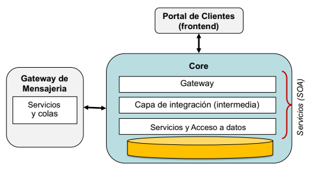

### 1. Situación de Contexto y Objetivos
<dl><dd align="justify">
  

    La empresa X posee una plataforma tecnológica que permite integrar distintos canales de comunicación digital (por ej., Facebook Messenger, Whatsapp, etc.) con clientes, gestionando la atención de los distintos tipos de mensajes y usuarios en relación a productos, servicios, etc.
     
    Adicionalmente, la empresa ofrece un portal de clientes, para gestionar las distintas comunicaciones, analizar indicadores de desempeño, y brindar información via dashboards, entre otras funcionalidades. 
  

  

    El principal objetivo de negocio es ofrecer un medio multi-canal efectivo para que un tercero (cliente) pueda lograr una atención efectiva y de calidad hacia sus usuarios. Desde el punto de vista de la empresa, se espera que la plataforma pueda ser robusta, escalable en términos de performance, extensible para nuevas funcionalidades, y que provea una buena experiencia de usuario, entre otros atributos de calidad.
  

  

    La implementación actual del sistema está basada en el paradigma de cliente-servidor y orientación
  a servicios.
  

  
(<a href="#top">Volver al inicio</a>)

</dd></dl>

### 2. Objetivos de Negocio
<dl><dd align="justify">
  

    Los objetivos de negocio de la empresa se resumen en los siguientes:
  

  - Brindar una gestión eficiente de los mensajes recibidos a través de los distintos canales, para los distintos clientes de la empresa.
  - Incrementar la cantidad de clientes operando en la plataforma.
  - Incrementar la cantidad de canales soportados.
  - Ampliar la oferta de servicios ofrecidos a los clientes (por ej., mediante chatbots o acciones automatizadas)

  
(<a href="#top">Volver al inicio</a>)

</dd></dl>

### 3. Principales Casos de Uso
<dl><dd align="justify">
  

    Las funcionalidades principales se resumen en los siguientes casos de uso:
  

  - Inicio del Portal (interfaz Web) que debe cargar toda la información de las bases de datos y mostrarla al operador, y/o al gestor correspondiente.
  - Ingreso de mensajes (conversaciones) de usuarios a través de un canal, que deben ser gestionadas, persistidas, y mostradas al operador.
  - Egreso de mensajes (conversaciones) de operadores, utilizando un canal determinado, que deben ser transmitidas al usuario correspondiente.
  - Gestion mediante dashboards y reportes varios (en modalidad batch).
  - Integración a futuro con APIs de otros sistemas (por ej., un CRM).

  
(<a href="#top">Volver al inicio</a>)

</dd></dl>

### 4. Atributos de Calidad drivers
<dl><dd align="justify">
  

    A partir de la identificación de los objetivos de negocio, se derivaron los atributos de calidad drivers
    descriptos a continuación. Estos atributos constituyen el primer paso para generar escenarios de
    calidad, y también para guiar la evolución hacia una versión mejorada de la arquitectura.
  

  <table>
    <tr>
      <th>Atributo de calidad</th>
      <th>Aspectos involucrados</th>
    </tr>
    <tr>
      <th rowspan="2">
        QA1. Interoperabilidad (con distintos canales)
      </th>
      <td>
            Se refiere a la capacidad de la empresa/plataforma de recibir, procesar, y tratar de manera uniforme, mensajes provenientes de distintos canales (multi-canalidad).
      </td>
    </tr>
    <tr>
      <td>
            Esta integración puede materializarse tanto desde los clientes hacia la plataforma (flujo entrante), o desde la plataforma hacia los clientes (flujo saliente).
      </td>
    </tr>
    <tr>
      <th rowspan="2">
        QA2. Modularidad y Facilidad de Mantenimiento
      </th>
      <td>
            La organización funcional del sistema involucra distintos tiers y componentes, y en cada uno de ellos existe una descomposición basada en servicios. Este atributo se refiere a reducir los costos de modificar cada uno de estos servicios, minimizando el impacto sobre otros servicios o sobre los almacenamientos de datos.
      </td>
    </tr>
    <tr>
      <td>
            Adicionalmente, es deseable poder desplegar facilmente los servicios en un ambiente cloud.
      </td>
    </tr>
    <tr>
      <th rowspan="2">
        QA3. Usabilidad y Experiencia de Usuario
      </th>
      <td>
          Este atributo se refiere brindar soporte a los distintos tipos de usuarios de la plataforma, ya sea para enviar/recibir mensajes como para gestionar eficientemente las comunicaciones y el portal de clientes.
      </td>
    </tr>
    <tr>
      <td>
          Respecto a los administradores de la plataforma, es importante contar con dashboards y otras herramientas (por ej., reportes) para monitorizar el funcionamiento de la plataforma.
      </td>
    </tr>
    <tr>
      <th rowspan="2">
        QA4. Performance
      </th>
      <td>
          El procesamiento de los mensajes entrantes debe realizarse con cierta latencia, que permita realizar las interacciones con los usuarios en forma fluida. Adicionalmente, el throghput a la hora de procesar mensajes es importante, tanto en los flujos entrantes como salientes.
      </td>
    </tr>
    <tr>
      <td>
          Este atributo se encuentra relacionado con la <ins>escalabilidad</ins> de la plataforma.
      </td>
    </tr>
    <tr>
      <th>
        QA5. Escalabilidad
      </th>
      <td>
          Ante un crecimiento en el número de clientes soportados, o en el número de mensajes enviados por los usuarios/canales, o incluso en el tipo de procesamiento a realizar sobre los mensajes, el sistema debe poder responder de manera adecuada. En caso que la carga sea demasiado alta, el sistema debe poder configurarse facilmente con mayores recursos en el ambiente cloud.
      </td>
    </tr>
    <tr>
      <th rowspan="2">
        QA6. Robustez y Tolerancia a fallas
      </th>
      <td>
          Ante fallas en los componentes del sistema (por ej., en ciertos servicios, por timeout), el sistema debe continuar operando y minimizar la exposición de estas fallas hacia otros componentes (efecto cascada) o hacia a los usuarios.
      </td>
    </tr>
    <tr>
      <td>
          El sistema debe preservar todos los mensajes, y en particular no debe perder ninguno de los mensajes entrantes. La trazabilidad del procesamiento de mensajes también es importante.
      </td>
    </tr>
    <tr>
      <th>
        QA7. Seguridad
      </th>
      <td>
          El acceso al sistema y su operación debe realizarse mediante roles autorizados. El sistema debe garantizar que no se comparte información entre distintos clientes.
      </td>
    </tr>
  </table>

  
(<a href="#top">Volver al inicio</a>)

</dd></dl>

### 5. Arquitectura Nocional Inicial
<dl><dd>
  

    La arquitectura nocional se divide en 2 partes bien diferenciadas: i) la recepción y envío de mensajes (conversaciones) a los usuarios, y ii) la interacción de las interfaces Web que utilizan los operadores de la plataforma. La primera parte se aborda mayormente con un Gateway de Mensajería, mientras que la segunda parte se trata mediante un Portal de Clientes que está soportado por una arquitectura (backend) de tipo Cliente-Servidor con distintos tiers. El Gateway de Mensajería eventualmente delega sobre el backend a fin de persistir datos. Este diseño está estructurado con un estilo orientado a servicios. El racional de diseño respecto a la elección de microservicios es apostar por una mayor escalabilidad, flexibilidad, y bajo acoplamiento; a costas de ciertos desafíos respecto a integración de los datos de los distintos microservicios y al desempeño de los mismos.
  

  

    La arquitectura se esquematiza a continuación.
  

  

    
  

  

    Dentro del core de la plataforma, existe una organización en distintos tiers:

  - <ins>Gateway:</ins> Este componente registra los distintos servicios disponibles, y ofrece al frontend un único punto de entrada para consumir las APIs de los distintos servicios. Adicionalmente, el gateway ofrece características de seguridad.
  - <ins>Capa de integración:</ins> Dado que las interfaces Web del Portal necesitan acceder a información integrada, que a menudo requiere el acceso a distintos servicios, se han desarrollado servicios “de integración” para este fin. Los servicios de integración proveen un API que delega en funcionalidad “básica” provistos por los servicios del tier anterior. Los servicios de integración no acceden directamente a los almacenamientos de datos. Existe un servicio de integración especial que articula con el Gateway de Mensajeria responsable de los canales.
  - <ins>Capa de acceso a datos:</ins> Los servicios en este tier encapsulan las funciones “atómicas” relacionadas con grupos de entidades de datos. Estos servicios solamente acceden a sus propias bases de datos, ya sea para operaciones de consulta o de escritura.
  

  

    La arquitectura (a nivel de prototipo) está implementada con las tecnologías Java y MySQL (mayormente), mediante el framework JHipster para Spring. El Gateway de Mensajería incluye la utilización de colas RabbitMQ.
  

  
(<a href="#top">Volver al inicio</a>)

</dd></dl>